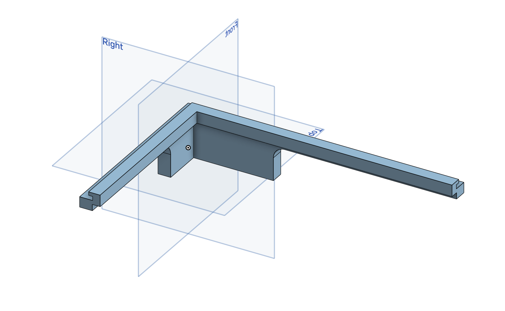
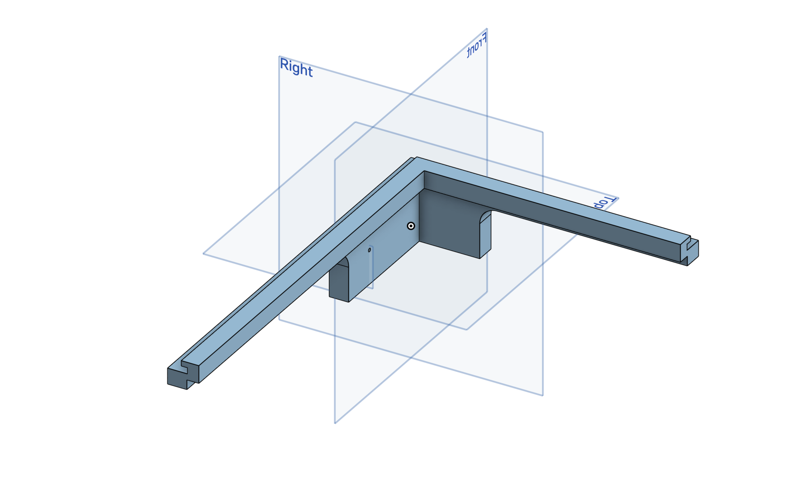

# Magic Mirror
Replace this text with a brief description (2-3 sentences) of your project. This description should draw the reader in and make them interested in what you've built. You can include what the biggest challenges, takeaways, and triumphs from completing the project were. As you complete your portfolio, remember your audience is less familiar than you are with all that your project entails!

<!---You should comment out all portions of your portfolio that you have not completed yet, as well as any instructions:-->

<!--- This is an HTML comment in Markdown -->
<!--- Anything between these symbols will not render on the published site -->

| **Engineer** | **School** | **Area of Interest** | **Grade** |
|:--:|:--:|:--:|:--:|
| Ammar S. | Dublin High School | Mechanical Engineering | Incoming Junior

<!--- **Replace the BlueStamp logo below with an image of yourself and your completed project. Follow the guide [here](https://tomcam.github.io/least-github-pages/adding-images-github-pages-site.html) if you need help.** -->

  
# Final Milestone

<!--- **Don't forget to replace the text below with the embedding for your milestone video. Go to Youtube, click Share -> Embed, and copy and paste the code to replace what's below.** -->

<!--- <iframe width="560" height="315" src="https://www.youtube.com/embed/F7M7imOVGug" title="YouTube video player" frameborder="0" allow="accelerometer; autoplay; clipboard-write; encrypted-media; gyroscope; picture-in-picture; web-share" allowfullscreen></iframe> -->

<!--- For your final milestone, explain the outcome of your project. Key details to include are:
- What you've accomplished since your previous milestone
- What your biggest challenges and triumphs were at BSE
- A summary of key topics you learned about
- What you hope to learn in the future after everything you've learned at BSE -->

# Second Milestone

<!--- **Don't forget to replace the text below with the embedding for your milestone video. Go to Youtube, click Share -> Embed, and copy and paste the code to replace what's below.** -->

<iframe width="560" height="315" src="https://www.youtube.com/embed/BnCfWkVadUs?si=U_ZmSntP_oZweoud" title="YouTube video player" frameborder="0" allow="accelerometer; autoplay; clipboard-write; encrypted-media; gyroscope; picture-in-picture; web-share" referrerpolicy="strict-origin-when-cross-origin" allowfullscreen></iframe>

My second milestone mainly consisted of planning out the final build and attaching the display and Raspberry Pi to the cardboard backboard. I am very surprised by how fast things are moving along in my project- I completed my first milestone yesterday morning and am already done with my second. After finalizing the calendar and weather modules, I was able to swiftly finish all the OS related issues right before my original SD card broke, which contained all the code I was working on. However, in just a few hours, I was able to recover all my progress and continue the building process of my Smart Mirror. I am now waiting on a 3D printed part that will allow me to do the final assembly of the Magic Mirror, and still allowing me to access the Raspberry Pi to add any software modifications before my final milestone.

# First Milestone

<iframe width="560" height="315" src="https://www.youtube.com/embed/LYNAZDGK9Ak?si=VZCwPjNqCTDcz1XT" title="YouTube video player" frameborder="0" allow="accelerometer; autoplay; clipboard-write; encrypted-media; gyroscope; picture-in-picture; web-share" referrerpolicy="strict-origin-when-cross-origin" allowfullscreen></iframe>

For my first milestone, I planned to get MagicMirror OS up and running and modify some of the modules to integrate into my life. For the physical project, I have a one-way mirror which a small screen will sit behind, allowing the modules to be visible while still being able to use the object as a mirror. The MagicMirror OS is running with a Raspberry Pi 4, which also allows me to easily customize, edit, and add anything I want using the Linux based Raspbian OS. Later on in the building process, I have plans to mount the Raspberry Pi to the back of the display using a removable yet secure method. So far, I have been able to install MagicMirror OS onto the Raspberry Pi and configure the different pre-installed modules. I added my iCloud account to the calendar module using vdirsyncer, a calendar syncing software, which allows my iCal (Apple Calendar) to sync to the MagicMirror calendar module on it's own. For the weather module, I used OpenWeatherMap's free account to create an API key, which is a unique code that allows an application to identify a user from an external software. I then found the location ID for my city and added it to the code, allowing the weather module to get the weather forecast for my location. Both the weather and calendar modules took a long time to configure, however I ended up being able to get it to work at the end through trial and error. Since the OS is fully configured to my liking, I will start to work on the frame for the mirror and attaching the components to the frame.

# Schematics 
<!--- Here's where you'll put images of your schematics. [Tinkercad](https://www.tinkercad.com/blog/official-guide-to-tinkercad-circuits) and [Fritzing](https://fritzing.org/learning/) are both great resoruces to create professional schematic diagrams, though BSE recommends Tinkercad becuase it can be done easily and for free in the browser. -->

# Code
Here's where you'll put your code. The syntax below places it into a block of code. Follow the guide [here]([url](https://www.markdownguide.org/extended-syntax/)) to learn how to customize it to your project needs. 

<body>

# config.js (Main config file for MagicMirror) 

<textarea class="scroll-box" id="myTextarea" readonly>
// config.js
let config = {
	address: "0.0.0.0",	// Address to listen on, can be:
							// - "localhost", "127.0.0.1", "::1" to listen on loopback interface
							// - another specific IPv4/6 to listen on a specific interface
							// - "0.0.0.0", "::" to listen on any interface
							// Default, when address config is left out or empty, is "localhost"
	port: 8080,
	basePath: "/",	// The URL path where MagicMirror² is hosted. If you are using a Reverse proxy
									// you must set the sub path here. basePath must end with a /
	ipWhitelist: [],	// Set [] to allow all IP addresses
									// or add a specific IPv4 of 192.168.1.5 :
									// ["127.0.0.1", "::ffff:127.0.0.1", "::1", "::ffff:192.168.1.5"],
									// or IPv4 range of 192.168.3.0 --> 192.168.3.15 use CIDR format :
									// ["127.0.0.1", "::ffff:127.0.0.1", "::1", "::ffff:192.168.3.0/28"],

	useHttps: false,			// Support HTTPS or not, default "false" will use HTTP
	httpsPrivateKey: "",	// HTTPS private key path, only require when useHttps is true
	httpsCertificate: "",	// HTTPS Certificate path, only require when useHttps is true

	language: "en",
	locale: "en-US",
	logLevel: ["INFO", "LOG", "WARN", "ERROR", "DEBUG"], // Add "DEBUG" for even more logging
	timeFormat: 24,
	units: "imperial",

	modules: [
		{
			module: "alert",
		},
		{
			module: "updatenotification",
			position: "top_bar"
		},
		{
			module: "clock",
			position: "top_left"
		},
		{
			module: "calendar",
			header: "Calendar",
			position: "top_left",
			maximumNumberOfDays: 5,
        		maximumEntries: 5,
			coloredText: true,
			config: {
				calendars: [
					{
                        			url: 'http://localhost:8080/modules/calendars/home.ics',
                       				symbol: 'calendar',
						color: "#91b9f2"
					},
					{
						fetchInterval: 7 * 24 * 60 * 60 * 1000,
						symbol: "calendar-check",
						url: "https://ics.calendarlabs.com/76/mm3137/US_Holidays.ics",
						color: "#f2a191"
					}
				]
			}
		},
		{			
			module: "compliments",
			position: "lower_third"
		},
		{
			module: "weather",
			position: "top_right",
			config: {
				weatherProvider: "openweathermap",
				type: "current",
				location: "yourLocation",
				locationID: "yourLocationID", //ID from http://bulk.openweathermap.org/sample/city.list.json.gz; unzip the gz file and find your city
				apiKey: "yourAPIkey"
			}
		},
		{
			module: "weather",
			position: "top_right",
			header: "Weather Forecast",
			config: {
				weatherProvider: "openweathermap",
				type: "forecast",
				location: "yourLocation",
				locationID: "yourLocationID", //ID from http://bulk.openweathermap.org/sample/city.list.json.gz; unzip the gz file and find your city
				apiKey: "yourAPIkey"
			}
		},
		{
			module: "newsfeed",
			position: "bottom_bar",
			config: {
				feeds: [
					{
						title: "New York Times",
						url: "https://rss.nytimes.com/services/xml/rss/nyt/HomePage.xml"
					},
					{
						title: "NYT Arts",
						url: "https://rss.nytimes.com/services/xml/rss/nyt/Arts.xml"
					},
					{
						title: "NYT Sports",
						url: "https://rss.nytimes.com/services/xml/rss/nyt/Sports.xml"
					},
					{
						title: "ABC US",
						url: "https://abcnews.go.com/abcnews/usheadlines"
					},
					{
						title: "ABC International",
						url: "https://abcnews.go.com/abcnews/internationalheadlines"
					},
					{
						title: "ABC Top Stories",
						url: "https://abcnews.go.com/abcnews/topstories"
					},

				],
				showSourceTitle: true,
				showPublishDate: true,
				broadcastNewsFeeds: true,
				broadcastNewsUpdates: true
			}
		},
		{
		    module: 'MMM-Remote-Control',
		    // uncomment the following line to show the URL of the remote control on the mirror
		    position: 'bottom_left',
		    // you can hide this module afterwards from the remote control itself
		    config: {
			customCommand: {},  // Optional, See "Using Custom Commands" below
			showModuleApiMenu: true, // Optional, Enable the Module Controls menu
			secureEndpoints: false, // Optional, See API/README.md
			// uncomment any of the lines below if you're gonna use it
			// customMenu: "custom_menu.json", // Optional, See "Custom Menu Items" below
			// apiKey: "", // Optional, See API/README.md for details
			// classes: {} // Optional, See "Custom Classes" below

		    }
		},

	]
};

/*************** DO NOT EDIT THE LINE BELOW ***************/
if (typeof module !== "undefined") { module.exports = config; }

void loop() {
  // put your main code here, to run repeatedly:

}
</textarea>

</body>

# Bill of Materials
<!--- Here's where you'll list the parts in your project. To add more rows, just copy and paste the example rows below.
Don't forget to place the link of where to buy each component inside the quotation marks in the corresponding row after href =. Follow the guide [here]([url](https://www.markdownguide.org/extended-syntax/)) to learn how to customize this to your project needs. -->

| **Part** | **Note** | **Price** | **Link** |
|:--:|:--:|:--:|:--:|
| CanaKit Raspberry Pi 4 4GB Starter PRO Kit | Running, processing, and controlling MagicMirror OS | $139.99 | <a href="https://www.amazon.com/CanaKit-Raspberry-4GB-Starter-Kit/dp/B07V5JTMV9/ref=sr_1_3?crid=1YL03XF51I6SD&dib=eyJ2IjoiMSJ9.4tX4qJd4-AxDDD69js_G-neZZayZnLPkOAoMKlA68Ex_k5w7ncQWqkgdh65x4T130CTlsRsEOWcJQJ5TBn8QZuEinB1Q_wrw26rm_gi1B8CwcqJ_ZszCHhL9UxActIa-1DUkDkvjAhMCPASLEDe7F2n_Rjb5vk6E5wAS8dcUXnVU-Oves62PyW_SzXHflBbLGT6w_I0iPc9yslfIdRMCjqBfYzwmnquSeQBnsOG66EI.2syIQEXkDMj28bUQ7cm2Yzya6HENDkbXZCSfgqqw_JY&dib_tag=se&keywords=canakit%2Braspberry%2Bpi%2B4%2Bpro%2Bstarter%2Bkit&qid=1720490000&sprefix=canakit%2Braspberry%2Bpi%2B4%2Bpro%2Bstrater%2Bkit%2Caps%2C135&sr=8-3&th=1"> Link </a> |
| 15.6'' FHD IPS Portable Monitor | Display for the Raspberry Pi, allowing the MagicMirror OS to be visible | $81.99 | <a href="https://www.amazon.com/Ingnok-15-6-FHD-Portable-Monitor/dp/B0CP7XRW9S/ref=sr_1_1_sspa?crid=2EZFSJU4EG811&dib=eyJ2IjoiMSJ9.KQEIPfIoRG5gQIylWvCL_B_YvetHYFlSZWqUypU0huFmpmMzKkkWo41Lc_IQrFVjqq7SBrMk7tHzlTYCEQd3Ms-bgfs91vonTM2d2ll4nVcEMJ2d17mLoXT6QKFn_tsZ0gsCXaDr2nsM67hD7mC3ROhMhL9P__CCFy0MUtw5yc5vRW6QNQkarOy-hgUXK7xlM3GZR2ZSFQYf_sRyPHBeR8S7GPk-pTj4kia8VkhHTlk.0QKZCsNeL-X37HjfA4_EpfTenncpFn6vMTmGHlIiO3k&dib_tag=se&keywords=ingnok%2Bportable%2Bmonitor%2B15.6&qid=1720490229&sprefix=Ingnok%2B%2Caps%2C208&sr=8-1-spons&sp_csd=d2lkZ2V0TmFtZT1zcF9hdGY&th=1"> Link </a> |
| Anker New Nylon USB C to USB C Cable (6ft 60W, 2-Pack) | Cables to power the Raspberry Pi 4 and Display | $10.99 | <a href="https://www.amazon.com/dp/B088N7KPZN/ref=twister_B0D2DK8YP3?th=1"> Link </a> |
| Nekmit Dual Port USB C Wall Charger, 40W PD | Power brick for the 2 USB-C cables | $26.99 | <a href="https://www.amazon.com/Nekmit-Charger-Charging-Adapter-MacBook/dp/B0BRMR4HCZ/ref=sr_1_12?crid=3LISJP0DQ00EU&dib=eyJ2IjoiMSJ9.P_mbD3pMIXTJBeI-ZP9-zQwDT9fpYsPrPz_553-NDdzutM7N0ZzSTI5FxZw3jBtwQU_B-vfo6APBjnl4-lAhMtuRI4oGGpvD8IuTIgcjQorIZvwyFH-wryUcDFdNs8eRGlJRfmvA8gXwploZk27xRfvVkreAaLkL53MuMbcMrzyXDC5IwIsOcEy7DdnAwqEnXg0sksKlBBklk8xJ66yBMn1z7ozKm1XMskxVml1327DEoQk1N7fDb4zgsUZd8eMv7EtXKxX3E_CZr8xXRkSW5n8SXApIL8rQqjtPgkoc3yM._J8h3qkufHsekb4Ov90Rzqvth-30jTn2Kkv3VRGBDGU&dib_tag=se&keywords=dual%2Busb%2Bc&qid=1719590221&s=industrial&sprefix=dual%2Busb%2Bc%2Bcha%2Cindustrial%2C603&sr=1-12&th=1"> Link </a> |
| 12x18 Picture Frame (2-pack) | External frame for the MagicMirror | $22.59 | <a href="https://www.amazon.com/Americanflat-12x18-Picture-Frame-Black/dp/B0BPN4YQCC/ref=sr_1_3_sspa?crid=2NOOHPTHF5NF1&dib=eyJ2IjoiMSJ9.gZJfT0xHiVic7nvFJ1IUroZhzbQ5ZK9xrJEvaVXYmbmEZaDIBcp5_itXosxfJu_n2c0Q2_IaNQKSSHuBFYF5816p-6vGvvrO3zid8Pl35eRjLn99gIIXks0ccfzsHR9Q4yZjeCm92_PP2EQmWcz_zeoWXW9KWZdv9NnvpzqW5-i4cPwYVpYHATRECONejPe16Ge6bFESuuGxC-XHm4WuxniOTqRdI0n_b87csGeljdVpqPOwL62ummWHiiW7JiFOHYVHoi9thofwRzcFwPaoZgS3HGjR-9mIyLai5kBjfoY.M7DG2Kx5w1_f-8shJacfTg6MMrXlFixGGpDfO4HL_g4&dib_tag=se&keywords=12X18+frame&qid=1720538808&sprefix=12x18+frame%2Caps%2C147&sr=8-3-spons&sp_csd=d2lkZ2V0TmFtZT1zcF9hdGY&psc=1"> Link </a> |
| Cardboard | Filler for empty space (can also be from boxes of components) | $4.39 | <a href="https://www.amazon.com/EcoSwift-Chipboard-Cardboard-Scrapbook-Sheets/dp/B0B29JMJL2/ref=sr_1_1?crid=292F89G0MLRCV&dib=eyJ2IjoiMSJ9.afk3XS5SGSrwEcCWLMftn_k-Yj9xaRhYgWvkQpnN3tOTDHE-G4au5dJCjNAWAq6N8X8DldmM59YJGt89VOsyLXe4whjecJsQoDOcbqhKNCJgI_jAgVk8ieZDOQbJ5T1OxPIBUqvbqsRZYHEhXxZD7jgApOuj6c4qy_vpd47FqXCih-lOuImmaOsbN1kMHWwI-aXIWP2HqFyW-rL5P07w3SEfL6A5d2S2ctKZ2HhYGCxZvfRZHXLA8Jjt6zzaLsK4XZaubjAD-Iu3Q7V5-ZPoqnbXQHrzQAQibW_sfgIPb78.qfHZkbh92MU09EUS9GWwZKFNDiejTvJ-tVwfhPzoClc&dib_tag=se&keywords=cardboard&qid=1720538442&refinements=p_85%3A2470955011&rnid=2470954011&rps=1&sprefix=cardboard%2Caps%2C145&sr=8-1"> Link </a> |
| 12 x 18 x 0.04 Inch Acrylic See-Through Mirror | Mirrored acrylic for the MagicMirror | $29.99 | <a href="https://www.amazon.com/0-04-Acrylic-See-Through-Mirror-Transparent/dp/B07F7RT17K/ref=sr_1_2?crid=2G8WXOG2L1MB6&dib=eyJ2IjoiMSJ9.W-Njxz3W5aXZUmBzdZiQTdcXNAXcP0D7-FMn666i_swUsmbnrPrTi7K7WLsC0ghem8hpwv7OOGI14XVz4T3hXjnB93W10OpRObIpo4wwoSuiq96Drypla1BKVGzCphDJGEBV1Nco6-3p9QuitviJiNjD8QrcvHvwQnluo5m9wsQcmgvMn-EmWaqIFrvtVquprV6Df9Qu8-E36qYaGGJ_PydN-5DUngNe3RGXPlXH8xrb0oZvs2FoXbjaBzJbv2og3sQmkxIM0FZILPYhYKZFkxKcG82xoNTg187Qo7s4N2c.Ty-C3eL23pSSWmlrxQXItFkswULFSB_iIEMru87ckKs&dib_tag=se&keywords=12X18%2B1mm%2Bacrylic%2Bsee-through%2Bmirror&qid=1720538765&sprefix=12x18%2B1mm%2Bacrylic%2Bsee-through%2Bmirror%2Caps%2C125&sr=8-2&th=1"> Link </a> |
| Gorilla Heavy Duty Double Sided Mounting Tape | Assembling the MagicMirror | $12.24/roll | <a href="https://www.amazon.com/Gorilla-Heavy-Double-Sided-Mounting/dp/B082TQ3KB5/ref=sr_1_1_sspa?crid=3ECPY5NA68DEX&dib=eyJ2IjoiMSJ9.3qhDIMc72DmDSIjB7_8-042J7XwT3CfpWsdXD3u9BK_i97L9d3gu5F8qGLtnfM2KSgSMZWJ8alRB51OuIqg8TQFZuXh8wmz-fLNK1TSoexaM4O5UAxU3LBOJoJtUb3poUdichYUUZCy_oA8Rm93xEyLrHAulNo32HBXd0EzysB8PSlntDLTxFBBWJrtg1sqNOnvU7wJFyGCmOEmEQNI74CamS9aW108u7eQO6aMWynIbZWRnucrGr9ZRVPEjJDqh2S_i4j2AHBKUoRsSKJ-r03MavH06afmaufcbsM_LXdY.NvdSFD17wfZ-jLi7Pi1F5F2E-_3BjJ4MdIciCMUZy50&dib_tag=se&keywords=gorilla%2Bmounting%2Btape&qid=1720539095&sprefix=Gorilla%2Bmount%2Caps%2C144&sr=8-1-spons&sp_csd=d2lkZ2V0TmFtZT1zcF9hdGY&th=1"> Link </a> |
| Scotch Painter's Tape | Assembling the MagicMirror | $13.99/roll | <a href="https://www.amazon.com/ScotchBlue-Original-Multi-Surface-Painters-inches/dp/B00004Z4DU/ref=sr_1_5?crid=2V51BRBTTCGB6&dib=eyJ2IjoiMSJ9.TWyVW2Z5SRmjScpS793uYElaROfAg8zvl5GfbzIdbWDUUHc0FDJLUhRgWBsGdXX6M2nVBr_qRMbbFD9Zls-LZdsQBvHRitxfHweeQ9X4SNMp9iWuWro2l_WRZnxCUUGX2yPqcYAU_C8E4Obh5QpaEemzFrbWDn1-ag587sEDto5k8_67LbrIvP-BEAyqdJLtD_egRCUUklYAmVs7_OTCWFeN8cmncaBI2pLbJGQ9eQQTklWr4IoH_C6oR1hMSlF-v_2lLlk_KBhcDfMWIMQXBaXItC4h1YAix8J2mTyaWMI.tnNNDI0Rho4A8x3QzeT_WkuMjJjipKWfzPW5d6HVC90&dib_tag=se&keywords=scotch%2Bblue%2Btape&qid=1720539191&sprefix=scotch%2Bblue%2Btap%2Caps%2C149&sr=8-5&th=1"> Link </a> |
| Walnut Wood Veneer Roll, 2”×50’ | Exterior finish | $15.99/roll | <a href="https://www.amazon.com/MOLIGOU-Plywood-Banding-Flexible-Adhesive/dp/B095WJBSDJ/ref=sr_1_15?crid=15045OKKIX3B&dib=eyJ2IjoiMSJ9.8j0u9qNdWjQeHJfST-hqKLwYaz3CEG-qp1L8PvuPOPaSfCROjQkUfvgrHYy9QZDUVD-8EPC_0sQSHnmGI2aLyr1EHeb_NWmjuoe6OYa-rCUaIVotasmY1PViTbtRgiYbs04AjNiTLf8DShiVXCrbsLjoZdn0yrl2BOmuoUlMZw_wzKlR8eUohnPK_1tMmuTj_Ydfrk98l-khxymshrh54hXIJ32P-Mwfzx_Hvl-quD0uaGrYILCG8wwcMcTEBYFaVJaTBknWR_hAzWv-KJRKei38Tk2Zilz3ruDc5VekMYQ.g17-Vfo_VZ-9cS61W2Zu5FGCyZqY6m9ADDmJrPy5_Mc&dib_tag=se&keywords=wood+veneer&qid=1720797911&sprefix=wood+vene%2Caps%2C137&sr=8-15"> Link </a> |
| Mod Podge, 8 oz. | Finishing for the wood veneer | $3.99 | <a href="https://www.amazon.com/CS11201-Mod-Podge-8-Ounce-1-Pack/dp/B003W0XR8M/ref=sr_1_1?crid=29M4E5TI1YXH0&dib=eyJ2IjoiMSJ9.kJukiJodRHNxQKZqsx5h78Tcc5lFo4fZPwj64kYpwPrryO_Tiubsf8qDIPJGf0WJeoWLAVGaGdAvNDYRn7G1cQ_jKDd9-4hEbePX2UlmM3HUJ1Wx6kEnmQ9T9KFq_9OY5yz9KC_csnpjvg_mrpo7KSjAJvOVVqV7m90018ZMQNb9kdlXQFgMHbEHOU3wQe09_i727DMbr0RiNigybUp3yAHOhAxb9Cm6bQg6ERDCzyfus-LmK8uJAtM70yMdWqQHHS6dK10Kg7Oq2IYFaM5M-XGDy-xwf37sCxZ38wezNrA.IS3vpMfc3vinKWJ1TTHFl1W6LTN_DlUhFRzN01w3zA0&dib_tag=se&keywords=mod%2Bpodge&qid=1720797744&sprefix=mod%2Bpodge%2Caps%2C150&sr=8-1&th=1"> Link </a> |
| Apple Barrel Acrylic Paint, Black | Color for cardboard | $4.49 | <a href="https://www.amazon.com/Apple-Barrel-J20404-Acrylic-Assorted/dp/B0018NBUPC/ref=sr_1_5?crid=18HZIYXWJLYZ5&dib=eyJ2IjoiMSJ9.ldtWGvXDCn_bh5yQccr3-B8xtqCS5Yv25-QrL0wK19IPIYx9IQycKFXHfSNpaRsuQCP_gbBi1bkcn6GT5nvq477qBUQnXyafWwPR_P0KevYpSZWkoCXiGQoCkMWZYUsHzM9-IPKYwsFypOQ-skQzllS1BRZmkH9ex9ne7S2bbx8-_ZJDu1YBQA138x3x9qOmpKrQ3vR8uOyTG0rbrVmhBvwE9c3bljYtQT053crybO2g5OzN1hXibgNg4HGc2jqMYbpZsA-5gOn2uBt7Li1_sGnE-_XcTe_Rk03_IcSJ3Kw.mr72LY44HjYDWIicYpqTQI6JQGYwR7wPq41wFL10-mg&dib_tag=se&keywords=black%2Bpaint&qid=1720798067&refinements=p_36%3A-700&rnid=2638325011&sprefix=black%2Bpaint%2Caps%2C149&sr=8-5&th=1"> Link </a> |
| Paintbrushes | To apply Mod Podge and black paint | $3.59 | <a href="https://www.amazon.com/Prasacco-Professional-Painting-Paintbrushes-Watercolour/dp/B0CQ27N61W/ref=sr_1_4?crid=26F6EUGT2F2ZY&dib=eyJ2IjoiMSJ9.kwrRSPUsRWxSpNycnOlka83OGeAUHPN1rzQ0Y8MkYJQjjbSKeLb49uVCGEq9aHF-TRzR7oZFrcMKiLofpTbYMgKVWnzF0S79jHKIKpVzETNHckyKzVGDeN3ZXv7Wb584IQY2jI4yg6crTm85836vbE-IBPiEL6pbztgDPuRDG1EBL2l37ilwgXL9k6bxrfbHAJc9aTgZMmGXbpd8quH20EsXafynbS0SRJqpVFRQWg0E76wfSVL8L78m9UKNsd-rVym01lJo-3zIAfq6VfhpfUF2aEsEOIZh74rb3qpxb0Y.g0S3ig2HFeI263-DjBQburiD_qj6KFJgqK1aW5xQV1s&dib_tag=se&keywords=paintbrush&qid=1720798401&refinements=p_85%3A2470955011&rnid=2470954011&rps=1&sprefix=paintbrush%2Caps%2C134&sr=8-4"> Link </a> |

# Starter Project ~ Calculator

<iframe width="560" height="315" src="https://www.youtube.com/embed/11uO045UJXM?si=Js6uuijvQxL4Y_IX" title="YouTube video player" frameborder="0" allow="accelerometer; autoplay; clipboard-write; encrypted-media; gyroscope; picture-in-picture; web-share" referrerpolicy="strict-origin-when-cross-origin" allowfullscreen></iframe>

When creating my starter project, I was able to explore the functions of switches, panels, microcontrollers, and batteries and how all of them could interact to create something. Through this project, I was able to learn soldering, which is melting some metal (solder) using a hot rod (soldering iron) to create conductive connections, and effective troubleshooting methods to solve problems that I may also encounter when creating my main project. When creating my calculator, one part of the 7-segment display was not lighting up as expected. After trying to resolder some connections and messing with the display pins, I found that a metal adapter was missing from the microcontroller board. I fixed this by taking some copper wire and solder to create my own adapter, which ended up working. While soldering, the soldering iron wasn't getting hot at the tip, which made soldering some of the pins closer together much harder than expected. Using the helping hands, a tool to help hold up boards and other components at any angle while working on them, I was able to slightly heat up the pins of the components allowing the solder to melt easier.
